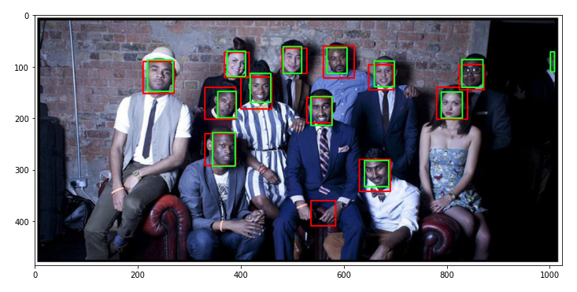
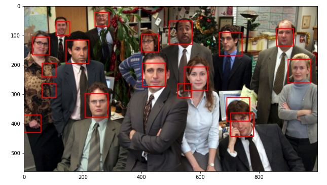

April, 2021

# face-detection-images

[See code and output in html file](https://htmlpreview.github.io/?https://github.com/shamalle/face-detection-images/blob/f0058326d323d7ca18125f1d95a75457603769be/face-detection-images.html)

In this project, a convolutional neural network (CNN) is implemented and trained for binary classification of image patches of faces and non-faces (with the help of data sets containing image patches of faces and backgrounds/non-faces.

Because of the model being fully convolutional (no fixed size inputs of layers) it can be used on bigger images and get a spatial map of face scores for different image patches (face recognition).

### Faces recognized with ground truth (green boxes)

### Faces recognized without ground truth

_Project done for the course 'Advanced Topics in Machine Learning'_